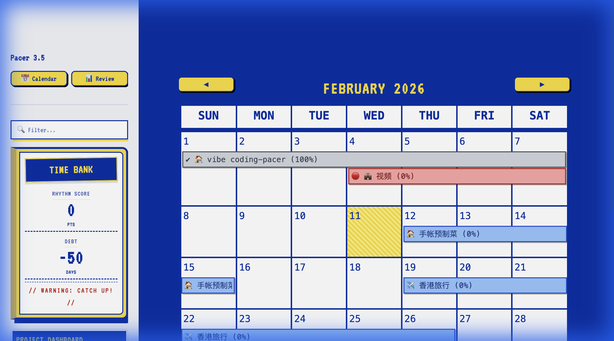
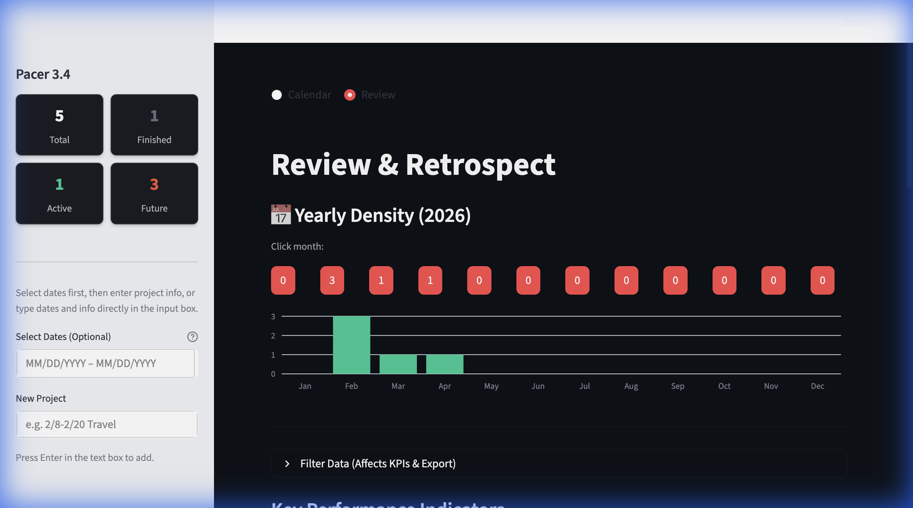
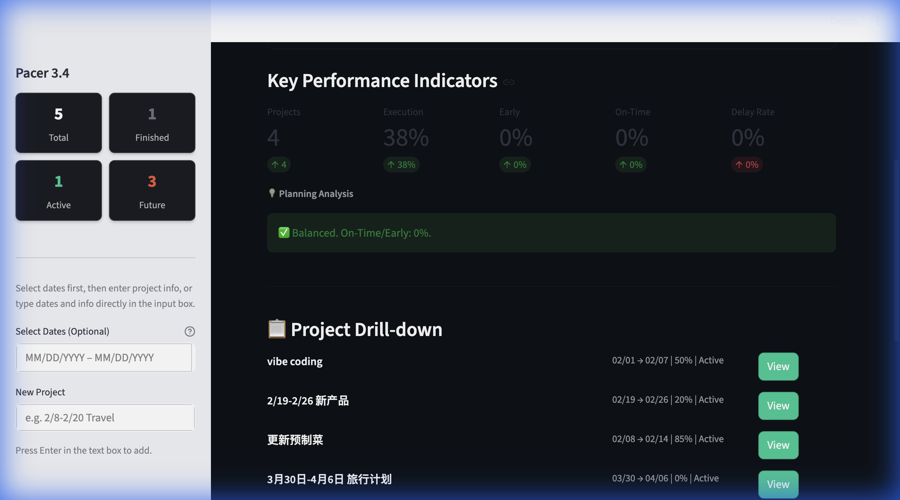
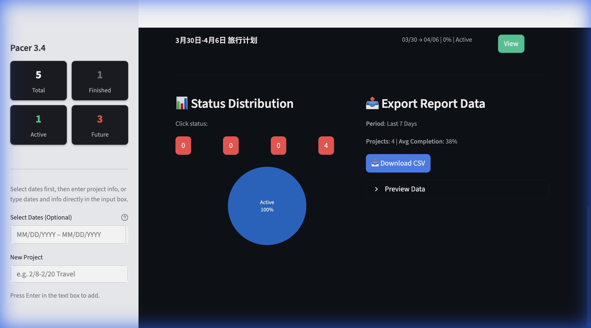
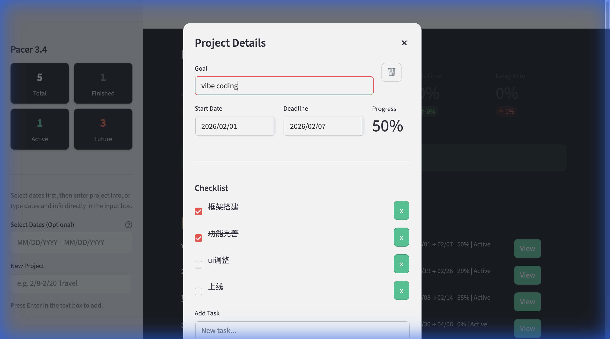

# 目标节拍 (Pacer AI)

<p align="center">
  
</p>

<p align="center">
  <b>🎯 智能目标节奏管理工具</b><br>
  克莱因蓝 × 柠檬黄 | Win98像素艺术美学 | AI驱动的目标拆解与可视化追踪
</p>

<p align="center">
  <a href="https://pacerai.streamlit.app">🔗 在线演示</a> ·
  <a href="https://github.com/pam-beep/Pacer_AI">📦 GitHub</a>
</p>

---

## 📖 项目概述

**目标节拍 (Pacer AI)** 是一款结合 AI 智能拆解与复古像素艺术美学的目标管理应用。用户通过自然语言输入目标（如"2月10号前完成PPT"），系统自动识别日期、智能生成可执行的 Checklist，并在日历视图中可视化追踪进度。

### 💡 主要亮点

- **🗣️ 自然语言解析** — 支持中英文，输入"下周五前完成报告"即可自动识别日期并创建项目
- **🤖 AI 智能拆解** — 自动将目标拆解为4个可执行的子任务，支持上下文感知
- **📅 日历可视化** — 月历视图展示所有目标，进度条实时显示完成率
- **📊 Review Dashboard** — KPI 面板、状态分布图、节奏分数、时间债务分析
- **⏱️ 专注计时器** — 内置番茄钟，记录专注时间
- **🗑️ 回收站系统** — 误删项目可恢复，像素风回收站UI
- **🏆 任务激励** — 完成100%时触发"MISSION ACCOMPLISHED"庆祝动画
- **🎨 Win98像素美学** — 克莱因蓝+柠檬黄配色，VT323像素字体，像素风按钮和图标

### 🎯 使用场景

- **个人目标管理** — 新年计划、学习目标、健身计划
- **项目里程碑追踪** — 小型项目的任务分解与进度管理
- **习惯养成** — 日历可视化帮助建立完成节奏
- **复盘分析** — Review Dashboard 生成周报/月报/年报数据

---

## 📸 应用截图

| 日历视图 | Review Dashboard |
|:---:|:---:|
|  |  |

| 数据下钻 | 数据导出 |
|:---:|:---:|
|  |  |

| 项目详情 |
|:---:|
|  |

---

## 🚀 快速开始

### 环境要求
- Python 3.9+
- （可选）OpenAI API Key —— 用于 AI 智能拆解任务，不配置时使用内置智能模板

### 安装步骤

```bash
# 1. 克隆仓库
git clone https://github.com/pam-beep/Pacer_AI.git
cd Pacer_AI

# 2. 安装依赖
pip install -r requirements.txt

# 3.（可选）配置 AI 能力
# 在项目根目录创建 .env 文件：
echo "OPENAI_API_KEY=your_api_key_here" > .env

# 4. 运行应用
streamlit run app.py
```

应用将在 `http://localhost:8501` 启动。

### 在线演示

🔗 **Demo**: [https://pacerai.streamlit.app](https://pacerai.streamlit.app)

> **注意**：在线版本无需配置 API Key，使用内置智能模板即可体验全部功能。

---

## 📦 技术栈

| 层级 | 技术 |
|------|------|
| **前端框架** | Streamlit |
| **日历组件** | streamlit-calendar |
| **可视化** | Plotly |
| **数据处理** | Pandas |
| **AI 引擎** | OpenAI API (可选) |
| **NLP 解析** | dateparser (多语言日期解析) |
| **数据持久化** | JSON 文件存储 |
| **设计风格** | Win98 像素艺术 (VT323 字体 + Klein Blue) |

---

## 📁 项目结构

```
Pacer_AI/
├── app.py                 # 主应用入口（日历、对话框、侧边栏）
├── review.py              # Review Dashboard 模块
├── persistence.py         # 数据持久化（JSON读写）
├── utils.py               # 工具函数（AI解析、日期提取）
├── styles.py              # 全局CSS样式
├── assets/                # 像素艺术图标资源
│   ├── recycle_bin.png
│   └── recycle_bin_small.png
├── screenshots/           # 应用截图
├── logo.png               # 项目Logo
├── requirements.txt       # 依赖列表
├── .streamlit/config.toml # Streamlit主题配置
├── LICENSE                # MIT License
└── README.md
```

---

## ⚙️ 部署说明

### Streamlit Cloud 部署
1. Fork 本仓库到你的 GitHub
2. 访问 [share.streamlit.io](https://share.streamlit.io)
3. 选择仓库和 `app.py` 作为入口
4. （可选）在 Secrets 中配置 `OPENAI_API_KEY`

### 本地部署
按照「快速开始」步骤操作即可。数据存储在本地 `pacer_store.json` 文件中。

---

## 📄 License

MIT License — 自由使用、修改和分发

---

## 🙏 致谢

- [Streamlit](https://streamlit.io) — 快速构建数据应用
- [Plotly](https://plotly.com) — 交互式可视化
- [dateparser](https://dateparser.readthedocs.io) — 多语言日期解析

---

<p align="center">
  Made with ❤️ by Pam · 目标节拍 Pacer AI
</p>
